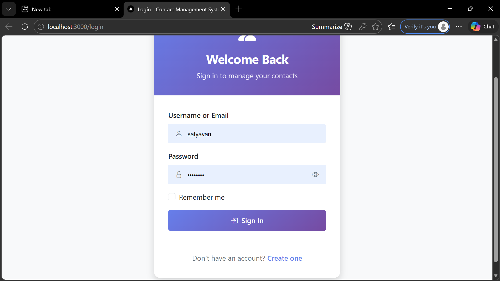
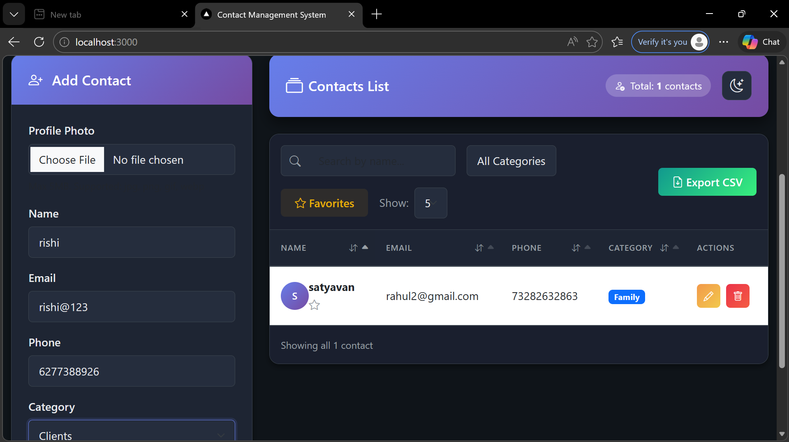
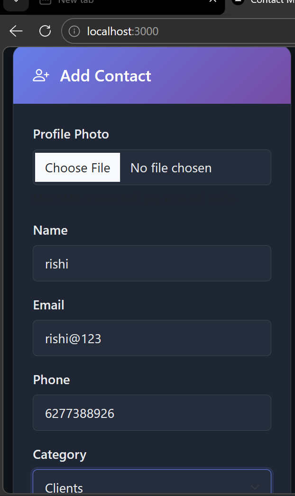

# 📒 Contact Management System


A full-stack web application for managing personal contacts with secure authentication, allowing multiple users to manage their own contact collections privately.

---

## 📋 Project Description

The **Contact Management System** is a comprehensive web application that enables users to securely manage their personal contacts. Built with a robust backend using Node.js and Express.js, it provides a seamless experience for organizing, searching, and exporting contacts. Each user has their own private contact list, ensuring data isolation and security through authentication.

This application is ideal for individuals or small teams who need a simple yet powerful contact management solution without complex infrastructure requirements.

---

## ✨ Features

### Core Features
- ✅ **User Registration & Login** - Secure account creation and authentication
- ✅ **Secure Authentication** - Passport.js with session-based auth and bcrypt password hashing
- ✅ **Add Contact** - Create new contacts with name, email, phone, and category
- ✅ **Edit Contact** - Modify existing contact information
- ✅ **Delete Contact** - Remove contacts with photo cleanup
- ✅ **Search Contacts** - Quick search by contact name
- ✅ **Pagination & Sorting** - Efficient data navigation with customizable sorting

### Advanced Features
- ⭐ **Favorite Contacts** - Mark important contacts as favorites
- 📂 **Contact Categories** - Organize contacts into Family, Friends, Work, Clients
- 🖼️ **Photo Upload** - Add profile photos to contacts (supports jpg, png, gif, webp)
- 📊 **Export to CSV** - Download all contacts as CSV file
- 🔐 **Multi-user Support** - Each user manages their own private contacts

### Security Features
- Password hashing with bcrypt
- Session-based authentication
- User ID filtering for data isolation
- SQL injection prevention via prepared statements
- Input validation and sanitization

---

## 🛠️ Technologies Used

### Backend
| Technology | Description |
|------------|-------------|
| **Node.js** | JavaScript runtime environment |
| **Express.js** | Web application framework |
| **Passport.js** | Authentication middleware |
| **Express-session** | Session management |
| **MySQL** | Relational database |
| **Multer** | File upload handling |
| **bcrypt** | Password hashing |

### Frontend
| Technology | Description |
|------------|-------------|
| **HTML5** | Markup language |
| **CSS3** | Styling |
| **Bootstrap 5** | UI framework |
| **JavaScript** | Client-side scripting |

---

## 📁 Project Architecture

```
contact-management-system/
├── config/
│   └── passport.js          # Passport.js configuration
├── database/
│   ├── contacts_migration.sql  # Contacts table schema
│   └── users.sql            # Users table schema
├── middleware/
│   └── auth.js              # Authentication middleware
├── models/
│   └── user.js              # User model & database operations
├── public/
│   ├── css/
│   │   └── styles.css       # Custom styles
│   ├── js/
│   │   ├── app.js           # Main application logic
│   │   └── auth.js          # Authentication handling
│   ├── uploads/             # Contact photo uploads
│   ├── index.html           # Main dashboard
│   ├── login.html           # Login page
│   └── register.html        # Registration page
├── routes/
│   ├── auth.js              # Authentication routes
│   └── contacts.js          # Contact CRUD routes
├── server.js                # Main server entry point
└── package.json             # Project dependencies
```

---

## 🚀 Installation Guide

### Prerequisites
- **Node.js** (v14 or higher)
- **MySQL** (v8.0 or higher)
- **npm** or **yarn**

### Step 1: Clone the Repository
```bash
git clone <repository-url>
cd contact-management-system
```

### Step 2: Install Dependencies
```bash
npm install
```

### Step 3: Configure Database
1. Create a new MySQL database named `contactbook`
2. Import the SQL files from the `database` folder:
```bash
mysql -u root -p contactbook < database/users.sql
mysql -u root -p contactbook < database/contacts_migration.sql
```

### Step 4: Configure Environment Variables
Create a `.env` file in the root directory:
```env
DB_HOST=localhost
DB_USER=root
DB_PASSWORD=your_password
DB_NAME=contactbook
DB_PORT=3307
PORT=3000
SESSION_SECRET=your-secret-key
NODE_ENV=development
```

### Step 5: Run the Application
```bash
npm run dev
```

This will:
- Start the development server on `http://localhost:3000`
- Automatically open the application in your browser

---

## 🗃️ Database Structure

### Users Table
```sql
CREATE TABLE users (
  id INT AUTO_INCREMENT PRIMARY KEY,
  username VARCHAR(255) NOT NULL UNIQUE,
  email VARCHAR(255) NOT NULL UNIQUE,
  password VARCHAR(255) NOT NULL,
  created_at TIMESTAMP DEFAULT CURRENT_TIMESTAMP,
  updated_at TIMESTAMP DEFAULT CURRENT_TIMESTAMP ON UPDATE CURRENT_TIMESTAMP,
  INDEX idx_email (email),
  INDEX idx_username (username)
);
```

### Contacts Table
```sql
CREATE TABLE contacts (
  id INT AUTO_INCREMENT PRIMARY KEY,
  name VARCHAR(255) NOT NULL,
  email VARCHAR(255) NOT NULL,
  phone VARCHAR(50) NOT NULL,
  category VARCHAR(50),
  user_id INT NOT NULL,
  is_favorite BOOLEAN DEFAULT FALSE,
  photo VARCHAR(255),
  created_at TIMESTAMP DEFAULT CURRENT_TIMESTAMP,
  FOREIGN KEY (user_id) REFERENCES users(id) ON DELETE CASCADE,
  INDEX idx_user_id (user_id),
  INDEX idx_is_favorite (is_favorite),
  INDEX idx_category (category)
);
```

---

## 🔌 API Endpoints

### Authentication Routes (`/auth`)

| Method | Endpoint | Description | Auth Required |
|--------|----------|-------------|---------------|
| POST | `/auth/register` | Register a new user | No |
| POST | `/auth/login` | Login user | No |
| POST | `/auth/logout` | Logout current user | Yes |
| GET | `/auth/current` | Get current user status | No |
| GET | `/auth/me` | Get authenticated user info | Yes |

### Contact Routes (`/contacts`)

| Method | Endpoint | Description | Auth Required |
|--------|----------|-------------|---------------|
| GET | `/contacts` | Get all contacts (paginated, searchable) | Yes |
| GET | `/contacts/count` | Get total contacts count | Yes |
| POST | `/contacts` | Create new contact | Yes |
| PUT | `/contacts/:id` | Update contact | Yes |
| DELETE | `/contacts/:id` | Delete contact | Yes |
| PUT | `/contacts/:id/favorite` | Toggle favorite status | Yes |
| POST | `/contacts/:id/photo` | Upload contact photo | Yes |

### Query Parameters (GET /contacts)

| Parameter | Type | Description | Default |
|-----------|------|--------------|---------|
| `page` | Number | Page number | 1 |
| `limit` | Number | Items per page | 5 |
| `search` | String | Search by name | "" |
| `sortBy` | String | Sort field (name, email, phone, created_at) | name |
| `sortOrder` | String | Sort order (asc, desc) | asc |
| `favorites` | Boolean | Show favorites only | false |
| `category` | String | Filter by category | "" |
| `export` | String | Export format (csv) | - |

---

## Project Screenshots

### Login Page



### Dashboard



### Add Contact



---

## 🔮 Future Improvements

- [ ] **Password Reset** - Implement email-based password reset functionality
- [ ] **Contact Import** - Import contacts from CSV files
- [ ] **Dark Mode** - Add dark theme support
- [ ] **Mobile App** - Create mobile responsive PWA
- [ ] **Contact Groups** - Allow creating custom contact groups
- [ ] **Notes** - Add notes field to contacts
- [ ] **Search Enhancements** - Search by email, phone, and category
- [ ] **Bulk Operations** - Select and delete multiple contacts
- [ ] **Email Integration** - Send emails directly from the app
- [ ] **Two-Factor Authentication** - Add 2FA for enhanced security

---

## 👤 Author Information

| Field | Details |
|-------|---------|
| **Project Name** | Contact Management System |
| **Version** | 1.0.0 |
| **License** | MIT |
| **Author** | [Your Name] |
| **Email** | your.email@example.com |
| **GitHub** | [Your GitHub Profile] |

---

## 📄 License

This project is licensed under the MIT License - see the [LICENSE](LICENSE) file for details.

---

<div align="center">
  <p>Made with ❤️ using Node.js & Express</p>
  <p>© 2024 Contact Management System</p>
</div>

Project created by Satyavhan Polei
